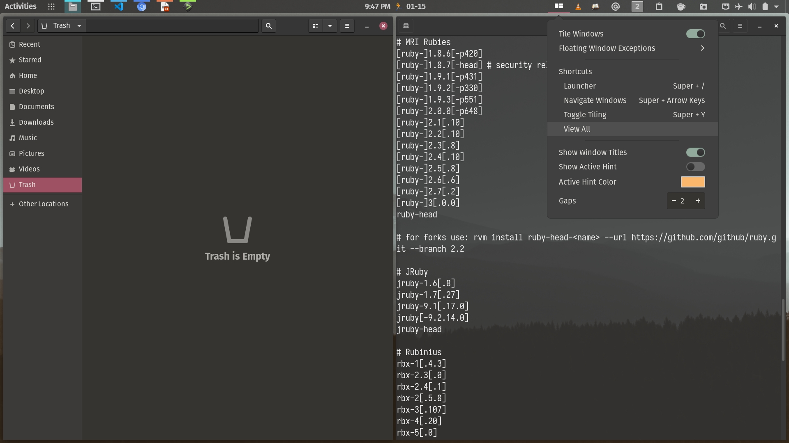

# Pop-Retro
gtk and gnome shell themes 

This theme is based on the works of `pop-theme` from system76, `pop-nord-theme` from Zaedus, `Retro` theme from paulxfce.

I couldn't figure out the light version for gnome shell, so only the dark version has it.

This theme workes well on pop OS 20.10 with Gnome 3.38.

